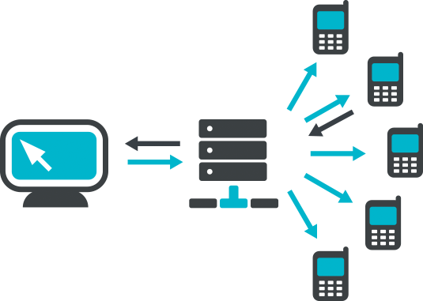

<p align="center">
  </a>
</p>

<h3 align="center">Send-SMS</h3>

<p align="center">
  
  
  
  
</p>

<div align="center">

Aplicação criada para disparos de SMS usando o Gateway - [Mobizon](https://github.com/mobizon/mobizon-php/tree/master/docs/examples)

</div>

## API Key

Necessário registrar a conta no site abaixo para obter sua key:

- [mobizon.com.br](https://mobizon.com.br)

## Iniciar aplicação

```bash
# clone
$ git clone git@github.com:gabyreis28/send-sms.git

# abrir pasta
$ cd send-sms

# configurar vars ambiente
$ cp .env.example .env

# instalar dependências
$ yarn

# iniciar aplicação
$ yarn send
```

## Contato

- [LinkedIn](https://linkedin.com/in/gabrieladiasreis)
- [gabriela.dias.97@hotmail.com](mailto:gabriela.dias.97@hotmail.com)